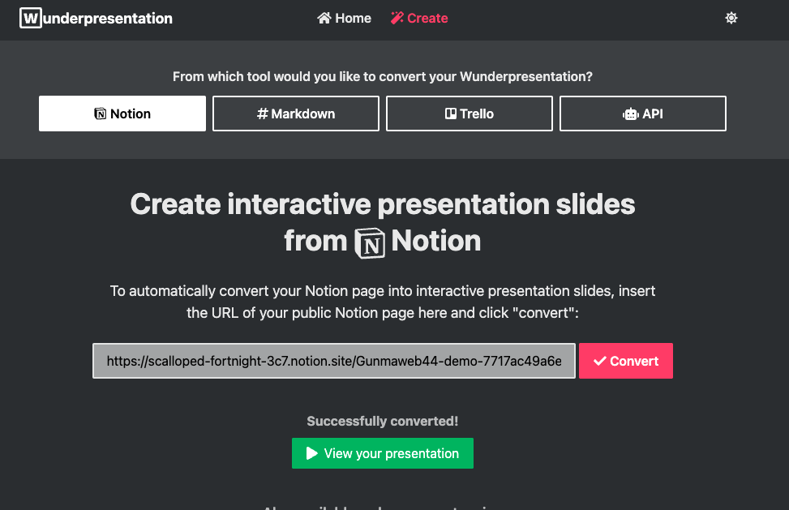
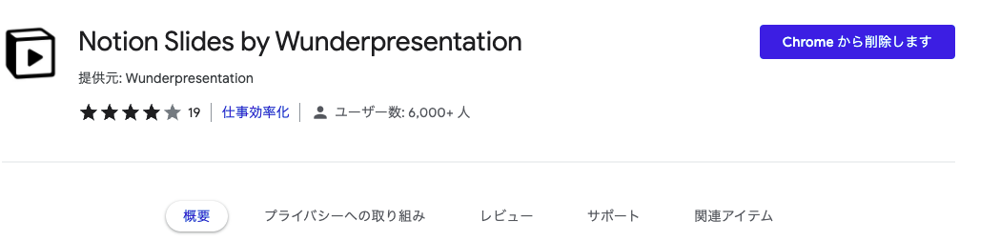

<!-- _class: lead -->
# Markdownで登壇資料を作りたい

Marp, Wunderpresentation

2022/02/05 horitks
Gunma.web #44 テーマフリー

---

# 自己紹介

- Name: Hori Takashi
- Twitter: @t_pori418
- Work:
  - 都内のWebシステムベンチャー企業でPM/EM
   → 三月からWebサービス系の企業でエンジニア
  - 複業で新規SaaSプロダクトの立ち上げ開発メンバー

今日は知ってる人は知ってるって感じの軽めのネタです

---

<!-- _class: lead -->
# スライドをMarkdownで書きたい！

できればWebサービスないかな...
ドキュメントとしても残せるようなやつ...

---

# swipe

- 知らなかったんですが、
サービス終了してました😢

---

<!-- _class: lead -->
# Notionから生成できたら便利では？

# →サービスあった

※notionの説明は割愛します。Webドキュメントツールです。

---

# wunderpresentation

- <https://wunderpresentation.com>

---

# Notion

- 書いたのはこんな感じ→

 

- 公開設定にして・・・

---

wunderpresentationのサイトでconvertする

---

# デモ

- Notion
  - [https://scalloped-fortnight-3c7.notion.site/Gunmaweb44-demo-7717ac49a6e84ae7802cbefb8b7244eb](https://www.notion.so/Gunmaweb44-demo-7717ac49a6e84ae7802cbefb8b7244eb)

- Wunderpresentation
  - [https://run.wunderpresentation.com/61f5724bdb8fe26d3ddea587](https://run.wunderpresentation.com/61f5724bdb8fe26d3ddea587)

---

# めっちゃ楽! けど

- notionを公開する必要がある
- スライドがPDFでDLできない
- 動画は表示されないっぽい

---

<!-- _class: lead -->
# Webサービスじゃなくても、

# 普段使っているエディタで楽に作れて

# git管理できると良い、と考えてみる

---

# Marp / VSCode に落ち着く
- [Marp](https://marp.app/)
  - Markdownでスライドを作れるOSS
  - VS Codeのプラグインがある
- [VSCode](https://azure.microsoft.com/ja-jp/products/visual-studio-code/)
  - Visual Studio Code
  - MSのエディタ

選定理由: VSCodeのプラグインがあって手軽そうだったから

---

# 開始手順
1. VSCodeインストール
2. 拡張のmarpをインストール

  これで markdown書くだけ

---

プレビューしながらマークダウンを書いていけます。

---

PDF出力して完成!

---

### Git管理できるしドキュメントに集中できて最高！
### 弱点は...

- 細かいレイアウトを気にし始めるとCSSとかを書く必要がある
  - (そっちのが好きな人には利点とも言える)
 
- パワポみたいに動画を埋め込むことはできない
 
- 画像の配置難しい

---

# 所感

- その場限りでPDFの配布ないLTとかならNotion+Wunderpresentationでサクッと作っちゃうのもアリかも

- 普段VSCode使ってるのでMarpはプラグイン利用できたので良い体験だった。プレビューしながら書けるのがでかい
今回はMarp+VSCodeで資料作成した。

- 関係ないけどPullRequestベースの発表とか自分もやってみたい

 
他に何か良いツールあるよって方いたら是非教えてください

---

### Appendix
WunderpresentationはChrome拡張もあります。
 

---

### Appendix

- プレビューだけならvscode-revealとかも良さげです。
- PDFはあんまりいい感じに出力できなかったです。
